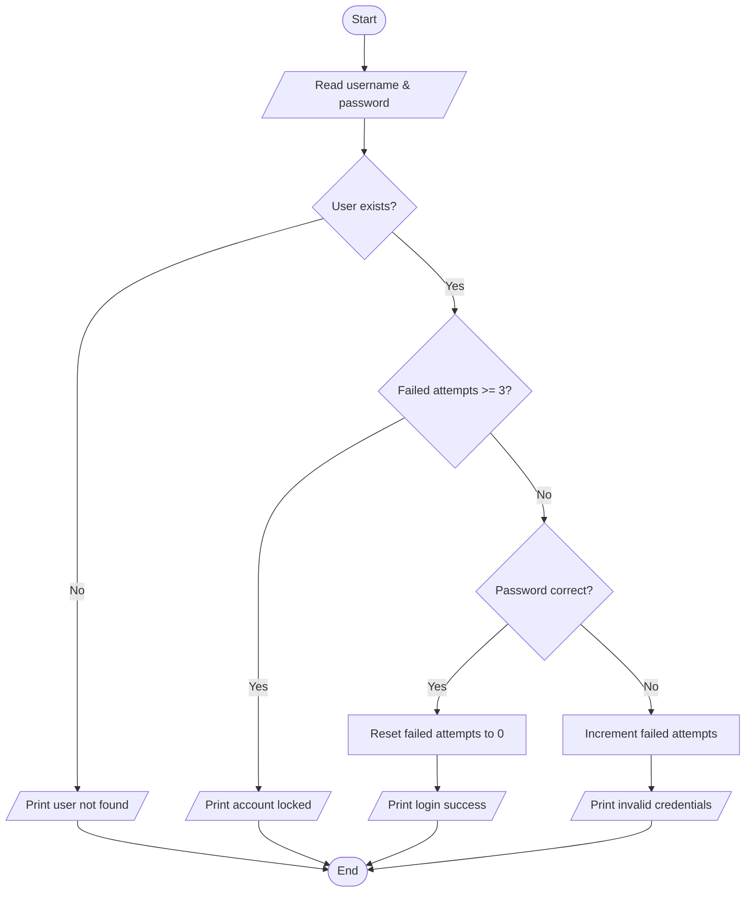

# Module 1 (Week 2): Algorithms, Pseudocode, and Flowcharts

## 1. Writing pseudocode

### Real scenario: Login attempt lockout

**Problem:** lock account after 3 failed attempts.

```text
ALGORITHM LoginLockout
INPUT: username, password
DATA: failed_attempts[username], stored_password[username]

IF username does not exist
    PRINT "User not found"
    STOP

IF failed_attempts[username] >= 3
    PRINT "Account locked"
    STOP

IF password == stored_password[username]
    failed_attempts[username] = 0
    PRINT "Login success"
ELSE
    failed_attempts[username] = failed_attempts[username] + 1
    PRINT "Invalid credentials"
END IF
```

## 2. Flowchart symbols (quick reference)

- **Oval**: Start/End
- **Rectangle**: Process
- **Parallelogram**: Input/Output
- **Diamond**: Decision
- **Arrow**: Flow direction

## 3. Creating flowcharts (Mermaid style)



## From-scratch exercise

Create pseudocode + flowchart for:

1. ATM withdrawal (insufficient balance handling).
2. File uploader with max size validation.
3. Ticket priority assignment (critical/high/normal).

